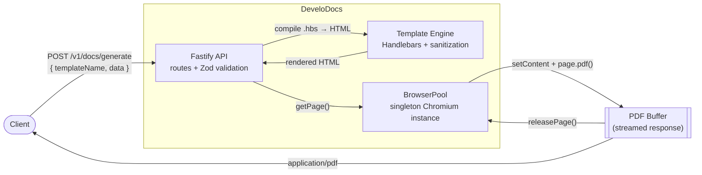

# DeveloDocs

**by DeveloClick**

A high-performance PDF generation microservice. It renders Handlebars templates to HTML and prints them to PDF with headless Chromium, exposed over a Fastify HTTP API.

Built with Node.js 20+, TypeScript (strict), Fastify, Playwright, Handlebars, and Zod.

---

## Architecture



`BrowserPool` keeps a single Chromium process warm for the life of the server and hands out an isolated `BrowserContext`/`Page` per request (bounded by `BROWSER_POOL_SIZE`), avoiding the cost of relaunching the browser on every call while keeping requests from leaking state into one another.

---

## Getting started

### Run with Docker (recommended)

Requires Docker and Docker Compose.

```bash
docker compose up --build
```

The API is available at `http://localhost:3000`.

> **Note:** if the project lives inside a OneDrive-synced folder on Windows, Docker's default BuildKit builder can fail on `package-lock.json` with `invalid file request` (OneDrive marks synced files as reparse points, which confuses BuildKit's file-sync protocol). If that happens, build with the classic builder instead:
> ```bash
> DOCKER_BUILDKIT=0 docker compose up --build
> ```

### Run locally (Node.js)

Requires Node.js 20+.

```bash
npm install
npx playwright install chromium
cp .env.example .env
npm run dev
```

### Scripts

| Command | Description |
|---|---|
| `npm run dev` | Start the API with hot reload (`tsx --watch`) |
| `npm run build` | Compile TypeScript to `dist/` |
| `npm start` | Run the compiled server (`dist/server.js`) |
| `npm test` | Run the Vitest integration suite |
| `npm run typecheck` | Type-check without emitting |
| `npm run benchmark` | Load-test a running instance and report PDFs/sec |

---

## Configuration

All variables are optional and have sane defaults — see [`.env.example`](.env.example).

| Variable | Default | Description |
|---|---|---|
| `NODE_ENV` | `development` | `development` \| `production` \| `test` |
| `HOST` | `0.0.0.0` | Bind address |
| `PORT` | `3000` | Bind port |
| `LOG_LEVEL` | `info` | Pino log level |
| `BROWSER_POOL_SIZE` | `3` | Max concurrent Chromium pages |
| `BROWSER_IDLE_TIMEOUT_MS` | `60000` | Reserved for future idle-page recycling |

---

## API reference

### `GET /health`

Returns service status and process uptime.

```bash
curl http://localhost:3000/health
```

```json
{ "status": "ok", "uptime": 42.17 }
```

### `POST /v1/docs/generate`

Renders a template with the given data and streams back a PDF (`Content-Type: application/pdf`).

**Body**

| Field | Type | Description |
|---|---|---|
| `templateName` | `string` | Name of a `.hbs` file in `src/templates/` (without extension) |
| `data.invoiceNumber` | `string` | Invoice identifier |
| `data.issueDate` / `data.dueDate` | `string` (date) | ISO date strings |
| `data.currency` | `string` | 3-letter currency code (default `USD`) |
| `data.company` | `{ name, address }` | Issuing company |
| `data.customer` | `{ name, email }` | Billed customer |
| `data.items[]` | `{ description, quantity, unitPrice, subtotal }` | Line items (at least one) |
| `data.subtotal` / `data.tax` / `data.total` | `number` | Totals |

All fields are validated with Zod; a malformed payload returns `400` with a list of issues. String fields are sanitized before rendering to strip `<script>`, event-handler attributes, and other markup capable of executing code.

**Example**

```bash
curl -X POST http://localhost:3000/v1/docs/generate \
  -H "Content-Type: application/json" \
  -o invoice.pdf \
  -d '{
    "templateName": "invoice",
    "data": {
      "invoiceNumber": "INV-2026-001",
      "issueDate": "2026-08-14",
      "dueDate": "2026-08-29",
      "currency": "USD",
      "company": { "name": "DeveloDocs Inc.", "address": "500 Market St, San Francisco, CA" },
      "customer": { "name": "Acme Corp", "email": "billing@acme.com" },
      "items": [
        { "description": "API Integration", "quantity": 1, "unitPrice": 1200, "subtotal": 1200 },
        { "description": "Support Retainer", "quantity": 3, "unitPrice": 150, "subtotal": 450 }
      ],
      "subtotal": 1650,
      "tax": 132,
      "total": 1782
    }
  }'
```

**Error responses**

| Status | Cause |
|---|---|
| `400` | Payload fails Zod validation |
| `404` | `templateName` does not match a known template |
| `500` | Unexpected rendering/browser failure |

---

## Benchmark

Measured locally with [`scripts/benchmark.ts`](scripts/benchmark.ts) (`npm run benchmark`), generating the sample invoice above repeatedly.

| Environment | Concurrency | Throughput | Avg latency | p95 latency |
|---|---|---|---|---|
| Docker container (`develodocs:local`) | 3 | **4.64 PDFs/sec** | 641ms | 751ms |
| Local Node process | 5 | 3.37 PDFs/sec | 1420ms | 1738ms |

Throughput is bounded by `BROWSER_POOL_SIZE` (concurrent Chromium pages) and available CPU — raising the pool size on a machine with more cores scales it close to linearly. Run it yourself against your own hardware:

```bash
npm run dev            # or: docker compose up --build
npm run benchmark
```

---

## Project structure

```
src/
  config/        env validation (Zod)
  core/          browserPool.ts, templateEngine.ts
  modules/pdf/   pdf.schema.ts, pdf.service.ts, pdf.controller.ts, pdf.routes.ts
  templates/     .hbs templates (e.g. invoice.hbs)
  utils/         logger, helpers
  app.ts         Fastify instance, global error handler
  server.ts      entrypoint, graceful shutdown
tests/           Vitest integration tests
scripts/         benchmark.ts
```
